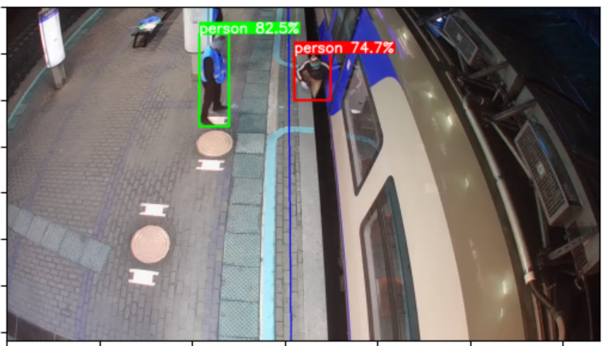

# Выпускная квалификационная работа по курсу "Искусственный интеллект и машинное обучение"

_Постановка задачи_: требуется распознавать опасные ситуации, когда люди заходят на пути или застревают в дверях поезда "Ласточка". Задача была поделена на две: сегментация облака точек для определения нахождения человека в дверях и детекция с изображения видеокамеры для детекции людей зашедших не туда.

# Детекция людей на изображении

Для детекции использовалась новейшая [YOLOv10](https://github.com/THU-MIG/yolov10).

# Сегментация облака точек

TODO

# Состав команды

 - Адиль
 - Стас
 - Егор
 - Егор
 - Ира
