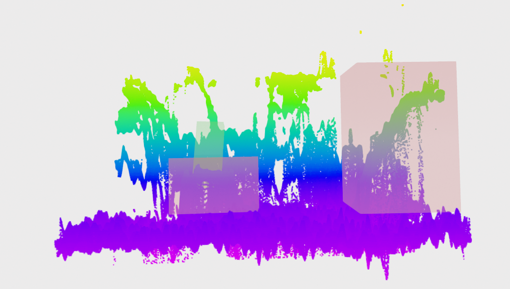

n# Выпускная квалификационная работа по курсу "Искусственный интеллект и машинное обучение"

_Постановка задачи_: требуется распознавать опасные ситуации, когда люди заходят на пути или застревают в дверях поезда "Ласточка". Задача была поделена на две: сегментация облака точек для определения нахождения человека в дверях и детекция с изображения видеокамеры для детекции людей зашедших не туда.

# Детекция людей на изображении

Для детекции использовалась новейшая [YOLOv10](https://github.com/THU-MIG/yolov10).

# Семантическая сегментация облака точек

Для каждой точки по облаку точек её соседей вычисляется список
признаков, вычисленный через собственные значения матрицы ковариации
позиций соседних точек. В итоге каждая точка имеет следующие признаки:
x, y, z, яркость и 8-10 значений зависящих от собственных значений
матрицы ковариации. Каждой точке присвоен класс, который достаётся из
разметки.

Далее на полученнаой таблице из точек и их наборов признаков обучается
Catboost(показал себя лучше чем другие модели).

В итоге имеем модель, которая присваивает метку класса каждой точке из
облака.

# Состав команды

 - Адиль
 - Стас
 - Егор
 - Егор
 - Ира
